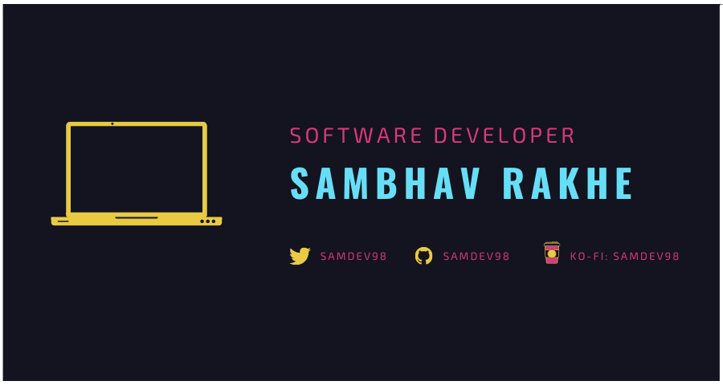

    

  
<strong>Table Of Contents</strong>

* [Introduction](#introduction)
* [Skills](#skills)
* [Projects](#projects)
* [Stats](#my-github-stats)

## Introduction:

## Skills:

## Projects:

  
<strong>Click to expand</strong>

  
  

## My Github Stats:

    

    

<!--START_SECTION:waka-->
<!--END_SECTION:waka-->