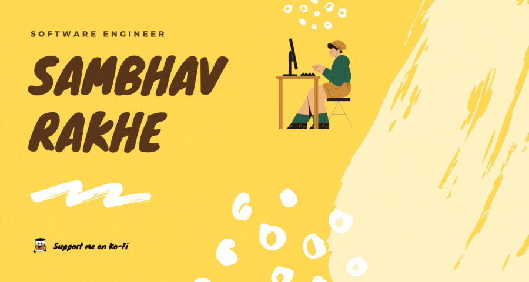

<p align="center">
<a href="mailto:rakhesambhav@gmail.com" alt="Gmail">
    
</a>
<a href="https://www.linkedin.com/in/sambhavrakhe" alt="Linkedin">
    
</a>
<a href="https://www.twitter.com/samdev98" alt="Twitter">
    
</a>
<a href="https://discord.gg/NRZb5NVX" alt="Discord">
    
</a>
<br>
<a href="https://ko-fi.com/samdev98" alt="Ko-Fi">
    
</a>
<br>
<a href="https://github.com/samdev98" alt="Waka Readme Status">
    
</a>
</p>
<br>
<hr>
<br>
<p align="center">
    <a href="https://github.com/samdev98" alt="Git Banner">
        
    </a>
</p>
<br>
<hr>
<br>
<details>
  <summary>

# Table Of Contents 👇

</summary>

* [Introduction](#introduction)
* [Skills](#skills)
* [Projects](#projects)
* [Stats](#my-github-stats)

</details>

# Introduction:

<h2> नमस्ते, (Namaste) 🙏🏻 I'm Sambhav Rakhe. A Software Developer from India. 🇮🇳 </h2> <br>
<p>

I have a **Bachelor's degree** 🎓 in **Computer Engineering** 🤓. <br>
I've been passionate about coding 💻 since I was 12 👦. The first language i ever wrote code in was C. <br>
Besides programming, I also love to **cook** 🍽 and practise **yoga**. 🧘 <br>
I currently strive to automate all my tasks using Python. 🐍 <br>
I am **always open to collaborate** 👻 with people on any projects, I pick up technologies that I don't already know,
rather quickly. <br>

</p>

I **like connecting with new people**, add me on [linkedin](https://www.linkedin.com/in/sambhavrakhe).
<br>
Feel free to **contact me** through my [email](mailto:rakhesambhav@gmail.com) or my
Twitter [@samdev98](https://twitter.com/samdev98). 🙂

# Skills:

Languages and Technologies:
<pre>
Python      ⬛⬛⬛⬛⬛
Java        ⬛⬛⬛⬛⬜
Golang      ⬛⬛⬛⬛⬜
Javascript  ⬛⬛⬛⬜⬜
Typescript  ⬛⬛⬛⬜⬜
C/C++       ⬛⬛⬛⬜⬜
</pre>

```python
from pprint import pprint

samdev98_info: dict = {
    'technologies': {
        'mobile_app': ['android'],
        'front_end': {
            'js': ['vue', 'react'],
            'css': ['materialize', 'vuetify', 'bootstrap']
        },
        'back_end': {
            'js': ['node', 'express'],
            'python': ['flask', 'django']
        },
        'dev_ops': ['docker', 'jenkins', 'nginx'],
        'databases': ['mongodb', 'mysql', 'sqlite', 'postgres'],
        'big_data': ['hadoop', 'spark', 'kafka'],
        'misc': ['firebase', 'selenium', 'prometheus', 'grafana']
    },
    'communities': {
        'tech_staff': "GirlScript",
        'student_volunteer': "RobinHoodArmy",
        'python_dev': "CodeSpeedy"
    },
    'current_focus': "Password manager based on Python"
}
pprint(samdev98_info)
```

# Projects:

<details>
  <summary><strong>Click to expand</strong></summary>

[](https://github.com/samdev98/password-manager-py)
</details>

# My Github Stats:

<p align="center">
    <a href="" alt="Github Stats">
        
    </a>
</p>

<p align="center">
    <a href="" alt="Github Streaks">
        
    </a>
</p>

<!--START_SECTION:waka-->


**🐱 My Github Data** 

> 🏆 353 Contributions in the Year 2021
 > 
> 📦 265.3 kB Used in Github's Storage 
 > 
> 🚫 Not Opted to Hire
 > 
> 📜 7 Public Repositories 
 > 
> 🔑 6 Private Repositories  
 > 
**I'm a Night 🦉** 

```text
🌞 Morning    4 commits      █░░░░░░░░░░░░░░░░░░░░░░░░   7.02% 
🌆 Daytime    8 commits      ███░░░░░░░░░░░░░░░░░░░░░░   14.04% 
🌃 Evening    31 commits     █████████████░░░░░░░░░░░░   54.39% 
🌙 Night      14 commits     ██████░░░░░░░░░░░░░░░░░░░   24.56%

```
📅 **I'm Most Productive on Sunday** 

```text
Monday       8 commits      ███░░░░░░░░░░░░░░░░░░░░░░   14.04% 
Tuesday      2 commits      █░░░░░░░░░░░░░░░░░░░░░░░░   3.51% 
Wednesday    6 commits      ██░░░░░░░░░░░░░░░░░░░░░░░   10.53% 
Thursday     13 commits     █████░░░░░░░░░░░░░░░░░░░░   22.81% 
Friday       0 commits      ░░░░░░░░░░░░░░░░░░░░░░░░░   0.0% 
Saturday     7 commits      ███░░░░░░░░░░░░░░░░░░░░░░   12.28% 
Sunday       21 commits     █████████░░░░░░░░░░░░░░░░   36.84%

```


📊 **This Week I Spent My Time On** 

```text
```


<!--END_SECTION:waka-->